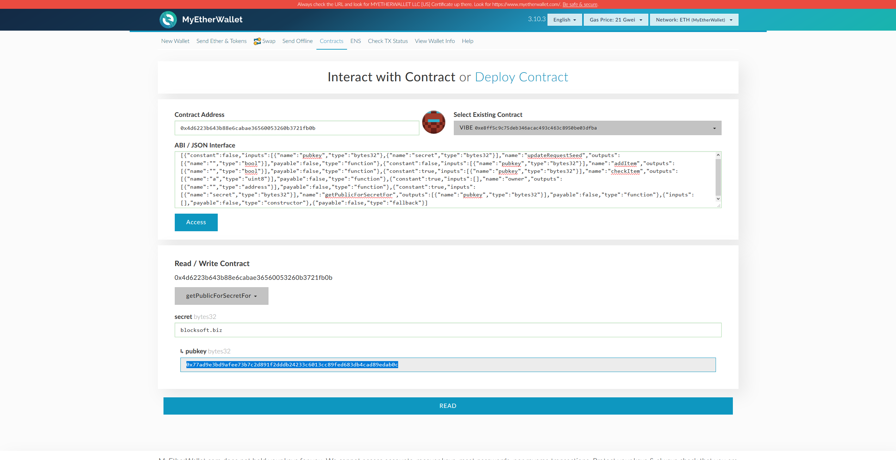
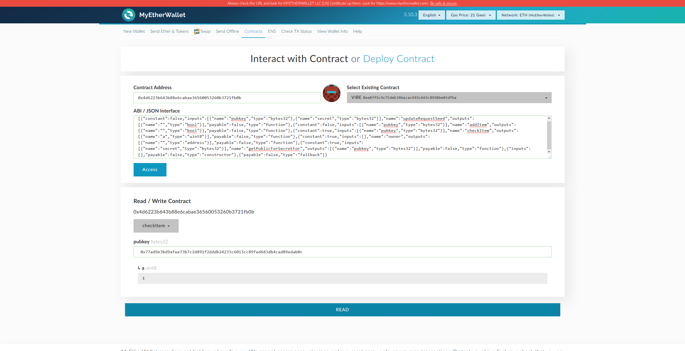

#Контракт

Для записи открытых кодов продуктов и их статуса в системе (куплен / нет) используется сеть Ethereum 

##Исходный код контракта

[Products.sol](contracts/Products.sol)

##Как изменения внести

- Изменить код

- Запустить компиляцию через Truffle
	
	truffle compile

- Проверить работу контракта через консоль Truffle

##Как использовать живой контракт

https://etherscan.io/address/0x4d6223b643b88e6cabae36560053260b3721fb0b#code

и в тестовой сети

https://ropsten.etherscan.io/address/0x45a728f342e8f2a019f77899730f2973a36b6d61

- Стоимость 0.000931413 - Генерируем публичный код для секретного кода **blocksoft.biz** 
и отправляем результат через **addItem(0x77ad9e3bd9afee73b7c2d891f2dddb24233c6013cc89fed683db4cad89edab0c)**

- Проверяем наличие записи по открытому коду **checkItem(0x77ad9e3bd9afee73b7c2d891f2dddb24233c6013cc89fed683db4cad89edab0c)**

- Стоимость	0.000642033 - Обновляем запись после покупки **updateItem(0x77ad9e3bd9afee73b7c2d891f2dddb24233c6013cc89fed683db4cad89edab0c, blocksoft.biz)**

##Как запускать проверки "бесплатно"

Бесплатные "монетки" http://faucet.ropsten.be:3001/

- адрес "производителя" - 0x33BDc3912BFED78E3b859F23BDAE4C414CB91EB1

- приватный ключ - 726f290e97aeb7a9ac181fb4c0e10be474e09eace154416403d3d579c14ebc73

- https://ropsten.etherscan.io/address/0x33BDc3912BFED78E3b859F23BDAE4C414CB91EB1

- адрес "отправки подтверждений" - 0x981E8b390aDc58542D80BFb6854C4b3fD6DF520C

- приватный ключ - 9cc7a88b2062a9c321ec36841eb6aaccad0a1ddd9eb66c25d1863f9a89e2f250

##Как уменьшить стоимость

- Если используем "классик" - до 0.025 usd за один товар

- Кошелек для управления https://ethereumproject.github.io/etherwallet/
